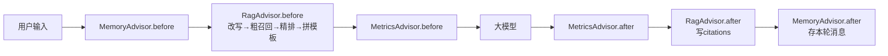

# smart-note架构

## 入库链路
用户上传知识库，或者Agent调用saveNote工具保存知识库时，通过`MarkdownDocumentReader`把文档标题写入`metadata`,再用`TokenTextSplitter`
按每`300`token+中文标点来切片，每个切片的内容前缀都是【文档名-标题】的格式，最后通过vector.add来把切片入库。

## 对话链路
`agentConfig`中定义了2个不同类型的`chatClient`，分别用于普通的对话和agent的对话，前者查询笔记内容，后者可以调用工具。
第一个`chatClient`包含三个advisor，分别用于对话记忆，rag检索/重排，记录输入输出，按照order依次排序, 执行顺序如下：

最外层是`MemoryAdvisor`， 用于存储用户的原始输入与大模型的最终输出，它的order=1，意味着在请求阶段，它是链上第一个被执行的advisor，
此时没有其他的advisor来对输入做改写，也没有对切片重排，上下文不存在，此时的输入就是用户的原始输入。在响应阶段，所有的上下文已经处理完毕，
大模型已经汇总了最终要输出的结果，把`MemoryAdvisor`放在最后一层，输出也就只有大模型的最终回答。因此设置它的order=1。

第二层是`RagAdvisor`， 用于查询改写，切片召回，包含粗召回和切片重排，查询改写是把用户的口语化的问题改写成不依赖历史对话的独立问题，让检索环
节能查到相关的内容。粗召回是根据相似度阈值`similarityThreshold`和排名前k的值`topK`来召回， 之所以是粗召回，是因为这是根据用户的问题来
匹配切片中的关联的文本，并计算相似度，然后找出相似度高于`similarityThreshold`的切片，取前k个切片， 但这样召回的切片不是很准确，因为可能是不
相关的内容，但恰好包含了用户问题中的关键字，导致评分变高，这个粗排的分数只能表示相似的关系，所以需要用`rerank`进一步精排。`rerank`使用切片+
查询成对送到`Transformer`，注意力机制来判断查询和切片是否相关，给出一个解答关系的分数，这个分数才能表示召回的这部分内容是否可以回答用户的这个
问题。 内部相关的组件如下：

|槽位|类|参数|为什么存在|
|---|---|---|---|
|改写|CompressionQueryTransformer（中文模板）| - | "那有什么缺点"检索失效;默认英文模板会把中文问题翻译成英文|
|粗召回|VectorStoreDocumentRetriever|topK=20,threashold=0.35|宽进，给所有符合搜索的文本设定的下限值|
|精排|RerankPostProcessor（自定义，调TEI）|score>0.1,limit=10|向量分不可比，用于过滤粗召回的不相干内容|
|拼模板|ContextualQueryAugmenter（中文模板）|allowEmptyContext=false|空上下文走中文兜底，无关问题直接拒答|

第三层是自定义的`metricsAdvisor`，用于记录大模型接收的内容和最终输出的内容。自定义advisor主要是实现`BaseAdvisor`接口，实现其中的`before`
和`after`方法，分别对应请求和相应阶段的逻辑。

## agent链路
第二个`chatClient`是agentClient，用于agent调用工具，它只有1个advisor，就是`MemoryAdvisor`，同样是用于保存用户原始输入和大模型最终
输出。它的特点是可以调用工具，工具是自定义的，Spring AI中通过`@Tool`注解来标记组件内的一个方法为工具，注解内的`description`参数用于描
述工具的用途，告诉大模型什么场景应该调用此工具。方法内的参数`@ToolParam`用户表示该工具需要的参数，注解内同样也有`description`，描述该
参数的含义，可以通过设置`required=false`表示此参数不必填，默认`required=true`，即必填。

