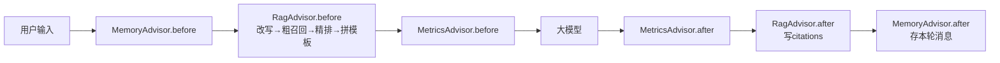

# note-recall

一个认真对待召回率的个人知识库 —— Spring AI 实现的 RAG + Agent 系统,
自带评估基准(检索准确率 100% / 回答正确率 92%)。

基于 Spring Boot 3 / Spring AI 1.1 / DeepSeek + 本地 Ollama(bge-m3)+ pgvector + TEI(bge-reranker-v2-m3)。

## 它能做什么

- **检索增强问答**:上传 Markdown 笔记,基于笔记内容回答,笔记里没有的会诚实拒答
- **多轮对话**:会话记忆 + 查询改写,"那有什么缺点?"这类模糊追问也能检索命中
- **两级检索**:向量粗召回(topK=20)→ 交叉编码器精排(rerank),分数可解释
- **Agent 工具**:对话中直接让它保存笔记,写入的内容立刻可被检索(写读闭环)
- **SSE 流式输出** + 引用溯源(返回回答依据的笔记来源)
- **MCP Server**: 对外暴漏三个笔记工具，可对接外部Agent

## 架构

详细设计见 [ARCHITECTURE.md](./ARCHITECTURE.md)

## 快速启动

前置:JDK 21、Docker、Ollama(`ollama pull bge-m3`)、DeepSeek API Key

```bash
# 1. 向量库
docker run -d --name pg -e POSTGRES_PASSWORD=xxx -p 5432:5432 pgvector/pgvector:pg17
# 2. 重排服务
docker run -d --name reranker -p 9080:80 -v /path/to/bge-reranker-v2-m3:/data/model \
ghcr.io/huggingface/text-embeddings-inference:cpu-latest --model-id /data/model
# 3. 配置:复制 .env.example,填入 API_KEY 等
# 4. 启动后:POST /document/upload 传笔记 → POST /chat/talk 提问
```

## 评估(Evals)

项目自带测试集与评分脚本,覆盖四类场景:概览问题 / 精确问题 / 完全无关(应拒答)/ 语义沾边(应拒答):
```bash
cd evals && python rag_test.py
```

当前基线:**检索准确率 100%,回答正确率 94.4%**

|日期| 语料                                                                  | 问题  | 参数                                                               |检索准确率|回答准确率|
|---|---------------------------------------------------------------------|-----|------------------------------------------------------------------|---|---|
|2026/08/23| 6篇                                                                  | 20个 | similarityThreshold=0.35, topK=20, rerankThreshold=0.1, limit=10 |100%| 92%                                                              |
|2026/09/11| 21篇| 30个 | similarityThreshold=0.35, topK=20, rerankThreshold=0.1, limit=10 | 100% | 94.4%                                                             |

## MCP Server

项目通过MCP Server(Streamable Http)暴漏检索与笔记工具， 可被Claude Desktop/Cursor等外部Agent调用，检索能力抽象为独立的工具，支持agentic RAG调用模式。

## LangChain/LangGraph实现

项目中通过LangChain做入库，LangGraph做状态图，实现note-recall的python版本，并通过MCP复用java侧的rerank检索能力。
详见[Python实现](./examples/README.md)

## 踩坑实录

调优过程的完整记录(含失败数据):
- [一张被污染的会话表:搞懂 Spring AI Advisor 的洋葱模型](https://juejin.cn/post/7676162994445025306):多轮记忆与 RAG 顺序打架引发的消息污染,advisor 执行模型拆解
- 检索三部曲:切块策略 / 召回失败排查 / rerank 实战(整理中)