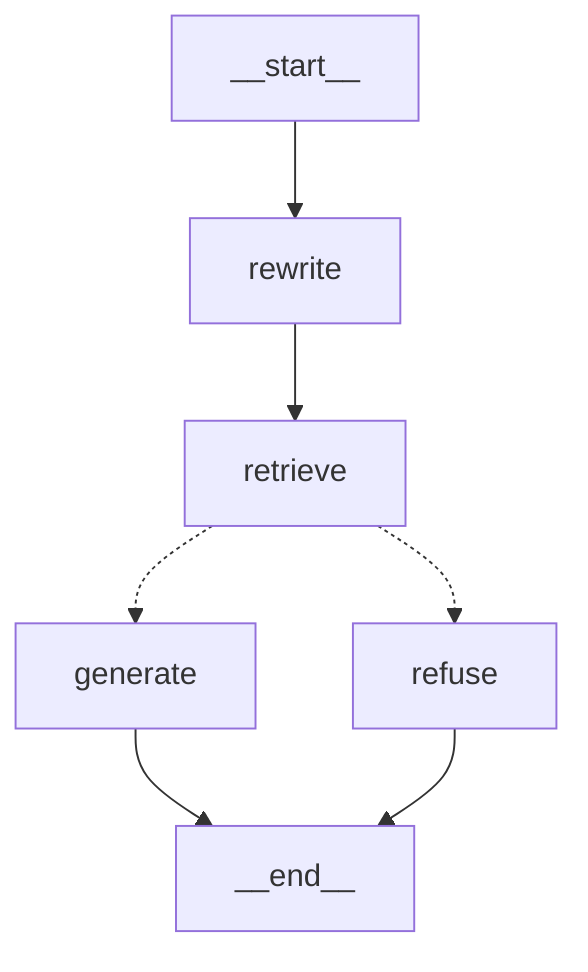

# LangGraph 客户端示例

[note-recall](../../README.md) 的 LangGraph 实现:用 LangChain 做入库、用 LangGraph 状态图做编排(改写 → 检索 → 条件分支),并通过 MCP 复用 Java 主项目的 rerank 检索能力。

定位是**同一个知识库、另一套技术栈的对照实现**,不是第二个产品:代码量刻意保持最小,重点展示两件事——

1. 隐式 advisor 链(Spring AI)与显式状态图(LangGraph)两种编排方式的差异;
2. Python agent 通过 MCP 协议调用 Java 侧工具的跨语言互操作。

## 架构



图由 `app.get_graph().draw_mermaid()` 自动生成,代码即图。

| 节点 | 作用 | 对应 Java 侧组件 |
|---|---|---|
| rewrite | 结合对话历史把追问改写成独立问题 | CompressionQueryTransformer |
| retrieve | 向量检索 + 相似度阈值过滤 | VectorStoreDocumentRetriever |
| generate / refuse | 有相关切片则基于笔记回答,否则拒答 | ContextualQueryAugmenter(空上下文分支) |

多轮记忆由 `MemorySaver` checkpointer 按 `thread_id` 隔离,对应 Java 侧的 ChatMemory。

MCP 部分(`mcp_agent.py`)不走上面的图:用 `create_agent` 构建 ReAct agent,通过 `langchain-mcp-adapters` 连接 Java 主项目的 MCP Server(`http://localhost:8080/mcp`),把 `searchNotes` / `saveNote` / `listNotes` 作为工具使用——检索、rerank 全部在 Java 侧完成。

## 文件说明

```
deps.py       单例依赖:LLM client、向量库加载、路径与环境变量(唯一的初始化入口)
ingest.py     入库:Markdown 按标题切分 → 按长度二次切分 → 拼接【文件名 - 标题】前缀 → bge-m3 向量化 → 落盘 store.json
graph.py      状态图定义与构建(build_app),节点通过闭包持有依赖
mcp_agent.py  通过 MCP 调用 Java 侧工具的 agent
main.py       组装与演示入口
```

## 运行

前置:Ollama 已拉取 `bge-m3`;Java 主项目已启动(MCP 部分需要);DeepSeek API Key。

```bash
cd examples/langgraph-client
uv sync                          # 安装依赖(版本由 uv.lock 锁定)
cp .env.example .env             # 填入 DEEPSEEK_API_KEY / DEEPSEEK_BASE_URL

uv run python ingest.py          # 一次性入库,生成 store.json(已 gitignore)
uv run python main.py            # 图问答 + MCP agent 演示
```

## 效果示例

图问答(多轮,第二问由 rewrite 节点改写后再检索):

```
question: redis缓存穿透怎么解决？
answer:   根据笔记,缓存穿透的解法有缓存空对象和布隆过滤器……

question: Redis缓存击穿如何解决？        ← "那击穿呢？" 改写后
answer:   根据笔记,缓存击穿的解法是互斥锁和热点数据永不过期……
```

MCP agent(Python 决策,Java 检索):

```
tools: searchNotes,saveNote,listNotes
reply: 根据笔记《Redis持久化》,Redis 持久化有 RDB、AOF 和混合持久化三种方式……
```

## 与 Java 版的差异与取舍

- 向量库用 `InMemoryVectorStore` 落盘 JSON,不接 pgvector——示例规模下够用,且避免两套框架共享一张表带来的 schema 耦合。
- 图本身没有 rerank,只有相似度阈值;需要精排时走 MCP 调 Java 侧的 `searchNotes`。
- `RELEVANCE_THRESHOLD` 的分数刻度与 pgvector 不同,更换语料后需用 `similarity_search_with_score` 重新标定。
- agent 的行为边界由 system prompt 约束(必须先检索、不用外部知识补答、只列出缺失知识点、不主动写入)——这是 agent 相比流水线在可控性上的代价所在。

## 依赖

Python ≥ 3.11,核心依赖:`langchain`、`langgraph`、`langchain-openai`、`langchain-ollama`、`langchain-mcp-adapters`。精确版本见 `uv.lock`。